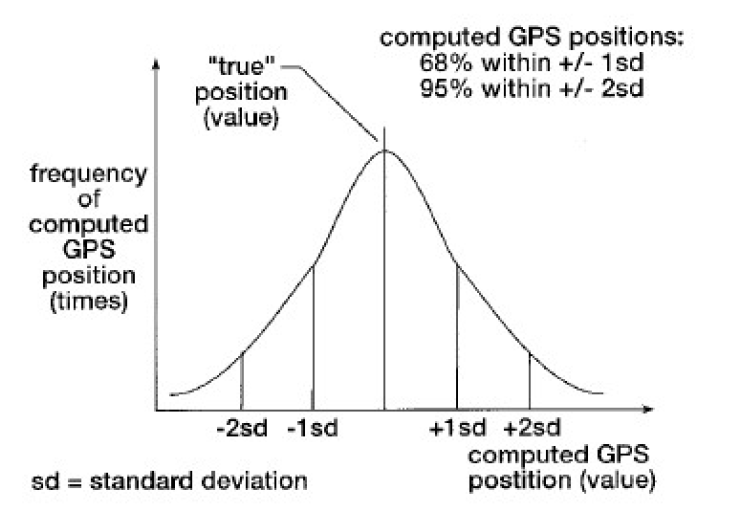
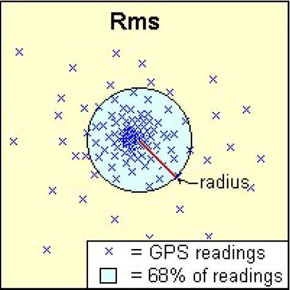
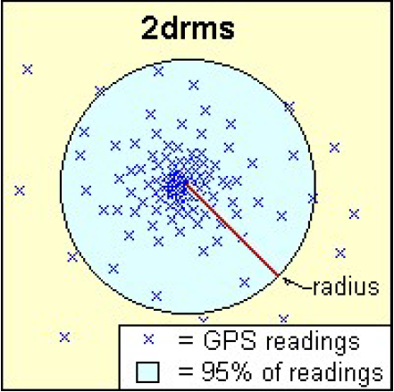
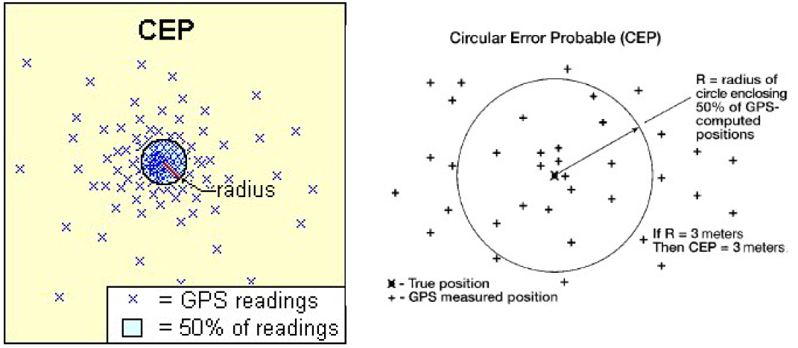
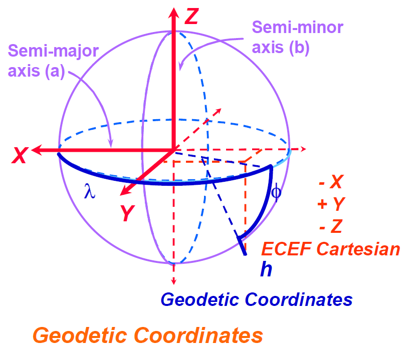

# GPS Static Positioning Measurement

tags：`Satellite Navigation`,  `Positioning Technology`, `Global Positioning System`, `Geographic Information Systems`


In  summarizes: This article discusses the interpretation of <font color='red'>GPS signals</font> and <font color='red'>GPS static positioning measurement</font>, as well as related accuracy indicators such as <font color='red'>RMS, 2DRMS, CEP</font>, and the <font color='red'>transformation between geodetic and navigation coordinates</font>. Through examples, the article demonstrates how to perform GPS calculations and coordinate transformations, and how to apply these technologies in practical geographic information systems.

## 1 Interpretation of GPS Signals and Positioning Measurements

### 1.1 Static Positioning Measurements



- GPS static position errors can be represented by a normal distribution.
- The standard deviation is a measure of the dispersion of a set of numbers.
- Approximately 50% of the values are within a range of 0.68 standard deviations from the mean of the true point.
- About 68.3% of the values are within one standard deviation from the mean of the true point.
- About 95.4% of the values are within two standard deviations from the mean of the true point.
- About 99% of the values are within three standard deviations from the mean of the true point.

### 1.2 Dynamic Positioning Measurements
- Dynamic positioning measurements are suitable for objects in motion, such as vehicles or drones.
- The accuracy of dynamic positioning is influenced by various factors, including the quality of the receiver, signal interference, and environmental conditions.
- Dynamic positioning typically requires more complex algorithms and real-time data processing.

### 1.3 Accuracy Indicators
- RMS (Root Mean Square): Represents the radius of a circle containing at least 68% of GPS readings.



- 2DRMS/2SD: Represents the radius of a circle containing at least 95% of GPS readings.



- CEP (Circular Error Probable): Represents the radius of a circle containing 50% of GPS readings.



## 2 Transformation between Geodetic and Navigation Coordinates

### 2.1 Geodetic Coordinate System


- Uses geodetic longitude, latitude, and height to describe spatial positions.
- The coordinate system origin is at the center of the reference ellipsoid, with the Z-axis pointing towards the North Pole and the X-axis pointing towards the prime meridian on the equator.

### 2.2 Earth-Centered Earth-Fixed Coordinate System
- The transformation process first converts data from the geodetic coordinate system to the Earth-centered Earth-fixed coordinate system.
- The Earth-centered Earth-fixed coordinate system is a right-handed coordinate system fixed to the Earth.

### 2.3 Local Tangent Plane Coordinates
- Data is transformed from the Earth-centered Earth-fixed coordinate system to the local tangent plane coordinates referenced by the navigation system.
- The local tangent plane coordinate system is commonly used to display data information on maps.

### 2.4 Coordinate Transformation Formulas
- The transformation formulas involve complex trigonometric functions and the geometric properties of the reference ellipsoid.
- The transformation takes into account the Earth's oblateness and the geometry of the reference ellipsoid.

> If two points in a field are close (usually within 1 minute change in longitude or latitude), then
>
> ``` mathematica
> x − x0 = Kx(Lon − Lon0)
> y − y0 = Ky(Lat − Lat0)
> Where
> x-x0 = displacement in east-west direction, m
> y-y0 = displacement in north-south direction, m
> Lat = latitude, expressed in radians
> Lon = longitude, expressed in radians
> Variables with subscript 0 refer to a reference position
> 
> Ky = a(1 − e^2)[1 − e^2 sin^2(Lat0)]^1.5
> 
> Kx = a cos(Lat0)[1 − e^2 sin^2(Lat0)]^0.5
> 
> Where
> a = equatorial radius = 6378135 m
> b = polar radius = 6356750.5 m
> e = √(1 − (b^2/a^2))
> ```

## Code explanation

I have implemented the aforementioned formulas in Python. By providing a benchmark point and a series of test points with their respective longitudes and latitudes, I have calculated the distance between each test point and the benchmark point, as well as the Root Mean Square (RMS), two-standard-deviation (2SD), and Circular Error Probable (CEP) error metrics for all distances.

To use, please navigate to the directory where this repository is located in the command line, and then execute `python GPS_Static_Positioning_Measurement.py`. When entering longitude and latitude values in the command line, please ensure that there is a space between the degrees, minutes, and seconds, for example, for 88°5'11'', please enter `88 5 11`.
